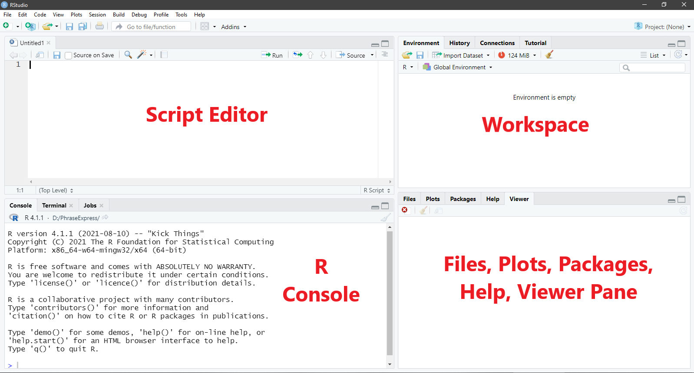

# Getting Started {#start}

To analyse data in R, you need both R and RStudio. These are _different_ programmes. Think of R as the software that executes our commands and RStudio as the interface between us and R that makes interacting with R a much more pleasant experience. If that doesn't make sense, here's a (hopefully relatable) example. 

Imagine you went to a hawker centre and there's an uncle manning the store. This uncle can only speak Hokkien but you can't. So, you tell your friend, who can speak Hokkien, what you want. Then, your friend translates that for the uncle, who then serves up a delicious meal for you. Think of the uncle in this example as R and your friend as RStudio. While you can try to "converse" with R directly, it's much easier to do so through RStudio. So... For the sake of your sanity, please do download both programmes!

## Install R and RStudio

Install R

For Windows

1.  Open an internet browser and go to <https://cloud.r-project.org/>.
2.  Under **Download and Install R**, Click on **Download R for Windows**. Click on **base**.
3.  Download the latest release by saving the .exe file on your computer. Double-click the file and follow the installation instructions.

For macOS

1.  Open an internet browser and go to <https://cloud.r-project.org/>.
2.  Under **Download and Install R**, click on **Download R for macOS**.
3.  Download the latest release by saving the .pkg file to your computer. Double-click the file and follow the installation instructions.

Install RStudio

Now that R is installed, download and install RStudio.

1.  Go to <https://www.rstudio.com/products/rstudio/download/>.
2.  Click **Download under RStudio Desktop**.
3.  Click on the version recommended for your system, or the latest Windows / macOS version, and save the file. Double-click the file and follow the installation instructions.

## The RStudio Interface

Now, start up RStudio. You should see something like this:

```{r 001-threepane, echo = FALSE, out.width = "100%", fig.cap = "R Studio Interface With Three Panes"}

knitr::include_graphics("img/001-threepane.png")

```

When you first start up RStudio, you will see three panes: the R console, the workspace, and the files, plots, packages, help, and viewer pane. Each pane serves different purposes.

1.  **R console**: The R console is where commands are submitted to R for R to execute. It is also where we find some of the output from R (e.g., analysis results).
1.  **Workspace**: I think of this as R's short-term memory. There are two tabs that are particularly useful.
    - **Environment tab**: We can find the list of objects (e.g., variables, data frames, functions) that we created in the session here.
    - **History tab**: Here is where we can find all the previous commands we submitted to R in the session.
1.  **Files, plots, packages, help, and viewer**:
    - **Files**: We can create new folders on our computer, move, delete, and rename files here.
    - **Plots**: We can find all the plots we instructed R to produce during the session here.
    - **Packages**: We can find, install, and update packages here. Packages contain data, functions, help menus, etc. that other people have created to supplement those in R. We will talk more about specific packages later.
    - **Help**: We can find information about a given command or package. We can also find more information about various commands and the packages on this website: <https://www.rdocumentation.org/>

_Note._ Because the Terminal tab, the Connections tab, and the Viewer tab will not be used in this course, we will not talk about them.

## R Script

To get R to do stuff (e.g., conduct analyses), we submit commands to R through RStudio. Although we can type the commands directly into the console, R users prefer to type the commands into what is called the script editor because we can save the commands in the script editor into script files (with the extension .R). The script files allow us to keep long-term records of the analyses that we have conducted. We can also share the script files with other R users so that they can reproduce our analyses. (We will use the words command and code interchangeably here.)

To open a blank R script, go to **File > New File > R Script**. Or, you can use the shortcut Ctrl + Shift + N (Windows) or Cmd + Shift + N (macOS). Notice that now, your RStudio has four panes. The script editor should now take up the top half of the left hand side of the screen as shown below.

```{r 002-fourpane, echo = FALSE, out.width = "100%", fig.cap = "R Studio With  Four Panes"}



```

## Some Tips and Tricks

Before we start coding proper, here are some tips to help you along your R journey! 

### Softwrap Long Lines

Sometimes, we might write commands in the Script editor section that are too long (horizontally) to fit the window. To see the entire command, we might need to scroll left and right. This can be frustrating. (It's like Notepad, without word wrap.) Fortunately, we can wrap the text such that the code fits into the size of the window. Go to **Code > Soft Wrap Long Lines**. 

### Make Notes or Comments

In R (and most programming languages), you can write notes or comments in the script to yourself and your readers. This is done in R by starting the line with a `#` sign. 

```{r eval = FALSE}

# This is a comment. 

```

Please make _liberal_ use of comments. They will help you understand what you're doing and why, especially if you haven't visited a project in a while. 

### Multi-Line Comments

To make your super long comments readable, you may break them into several lines, starting each line with `#>`.

```{r eval = FALSE}

#> This is a comment
#> that has been broken
#> into multiple 
#> lines.
#> :) 

```

### Setting working directory

Typically when we analyse data, we need to reference external files (e.g., our data files). To tell R where to look for those data files, we need to specify the full file path (i.e., the file location). While this is fine if you only have one or two things to reference, it can be kind of tedious to keep typing the file path if you have many things to reference. Furthermore, if you choose to change your file location, it would be quite a hassle (and also error-prone) to have to update all those file paths in the script. 

What we can do instead is to set a working directory in R using the function `setwd()`. This tells R where your data files are stored for the session, so it will know to look there. It will also be the place that R saves any output (e.g., plots). 

To get the file location in Windows, we first go to the folder where the file is located, right-click on the address bar, and click **Copy address as text**. We then need to convert the backslashes in the file path to forward slashes before we can use it. Let's say the file path is `C:\Users\Win10\Desktop\R`. After converting all the backslashes to forward slashes, the file path to use is `C:/Users/Win10/Desktop/R`. 

In macOS, there are several ways to get the file path. For instructions, please visit this website: <https://www.dev2qa.com/how-to-get-file-path-in-mac/>. Note that the file paths in macOS already use forward slashes, so changing backslashes to forward slashes is not an issue for macOS users. 

After getting the file path, you can then set the working directory as follows, with the file path encased in open/close inverted commas, within the parentheses. 

```{r eval = FALSE}

# Set working directory
setwd("C:/Users/Win10/Desktop/R")

```

### Using R Projects

While setting the working directory manually is sufficient when we have one or two projects, many of us have multiple projects on-going at the same time. If we have a bunch of different files from different projects all strewn in a single directory (folder), it can get quite messy. To stay organised, it is best that we create an R project for each project we are working on.

To do this, go to **File > New Project**. A dialogue window with three options, "New Directory", "Existing Directory" and "Version Control", will appear. From here, you may choose either "New Directory" or "Existing Directory". If you chose "New Directory", R will create a new folder and create an R project within that new folder. If you chose "Existing Directory", R will create an R project within an existing folder that you specify. Either will work, but I usually select "Existing Directory" as I would already have created my own folder to house materials related to a specific project.  

After RStudio has created the project, it will change the working directory to the project directory so that you can access all the files (e.g., data, script) related to this project in this directory. RStudio will also create a file with the extension .Rproj in the project directory. When you open this file, RStudio will automatically start a new session with the project directory as your working directory.

While it is not absolutely necessary to use RStudio projects in this course, I recommend it because it will help keep you organized.

### Debugging

When you are programming, you will make errors ("bugs") in your code. Trying to figure out where you made the error ("debugging") can be extremely time-consuming and frustrating. To help you along, here are some of the most common bugs that you'll run into. 

1. Misspelled object or function
    - Misspelled object (e.g., condition vs condtion) will throw this error message: _Error: object not found_
    - Misspelled function (e.g., `t.test` vs `ttest`) or trying to use functions in packages that have not been loaded yet will throw this error message: _Error: could not find function_
    - R is case-sensitive. So if your object is called _Dataset_, you need to type _Dataset_ and not _dataset_, else it will throw an error message. 
    - If you're referring to a variable in the dataset, you must attach the `$` sign (e.g., dataset$variable). Otherwise, R will tell you it cannot find the object.
1. Punctuation mistake
    - Remember to close the parenthesis ()
    - Don't add a space where there shouldn't be. For example, if your object is called _dataset_, don't type _data set_.
    - Use the correct punctuation for the function. For example, if the function requires a comma, don't put in full stops. If it requires a double equal sign, don't put in a single equal sign. 

If you've tried all the above and still can't figure out what's going on, just copy and paste the warning into the search engine. 99% of the time, you'll be able to figure out what happened by reading responses on forums or other websites. (Programmers are super helpful!)

### Last Words

In general, students new to programming tend to be hesitant to experiment, worried that they'd break the software or something. Please be assured that this rarely happens (except maybe when you write a loop function that doesn't stop looping!). So just have fun and experiment. If RStudio freezes, just close it and re-start!
  
Congrats! You've now installed R and RStudio! You're now ready to move on to some basics! =D
